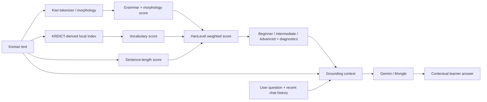

# 🫧 HanLevel v1.0 — Architecture

## System overview

HanLevel v1.0 is a hybrid educational NLP system with two separate layers:

1. a deterministic readability analyzer;
2. a grounded generative AI tutor.



---

## 🌸 Analyzer layer

### Inputs
- Korean text.

### Vocabulary
- Kiwi provides lexical tokens / POS information.
- HanLevel normalizes relevant predicates.
- Tokens are matched against a compact local index derived from the Korean Learners' Dictionary.
- Graded vocabulary is mapped to project-specific values.

### Grammar / morphology
Selected Kiwi tags contribute weighted structural complexity.

Current weighted categories include:
- EP,
- EC,
- ETM,
- ETN,
- VX,
- JKQ.

The grammar score combines:
- structural-marker contribution,
- morphology-density contribution.

### Sentence length
Average eojeol per sentence contributes an additional complexity signal.

### Final score

Nominal weights:
- vocabulary: 45%,
- grammar: 35%,
- sentence length: 20%.

When vocabulary scoring is unavailable, available components are renormalized.

Current bands:
- Beginner: below 25,
- Intermediate: 25 to below 50,
- Advanced: 50 or above.

---

## 🤖 Tutor layer

The tutor is implemented in `tutor_agent.py`.

### Grounding context

Before calling Gemini, HanLevel serializes:
- Korean source text,
- final level,
- final score,
- vocabulary score,
- grammar score,
- sentence-length score,
- average eojeol,
- dictionary coverage,
- up to 16 detected intermediate / advanced vocabulary items,
- up to 16 detected weighted grammar markers,
- recent conversation history.

### Prompt constraints

The tutor is instructed to:
- treat supplied diagnostics as authoritative for analyzer claims,
- never invent scores or detected markers,
- distinguish general Korean-language knowledge from analyzer evidence,
- preserve source meaning in rewrites,
- provide concrete vocabulary alternatives,
- avoid official-level claims when unsupported,
- answer in the learner's language,
- remain concise and learner-friendly.

### Model routing

Primary:
- `gemini-3.5-flash`

Fallback:
- `gemini-3.5-flash-lite`

The app handles common provider failures and exposes a user-friendly error state.

---

## 🌍 Localization layer

The Streamlit interface includes presentation-string localization for:
- English,
- Portuguese,
- Spanish.

The analyzer's internal keys stay unchanged.

The selected interface language also adds a language instruction to the tutor request so generated answers match the UI language.

---

## 🔐 Secrets

Runtime secrets:
- `GEMINI_API_KEY`
- optional `CONTACT_EMAIL`

Local Streamlit secrets should be stored in:

```text
.streamlit/secrets.toml
```

This file is excluded from version control.

---

## 🪞 Design principle

The central architectural choice is:

> **generation does not determine measurement.**

The readability estimate remains inspectable and reproducible.

Generative AI is used only after analysis, where its strength is most useful: explanation, contextual tutoring, rewriting, and learner interaction.
