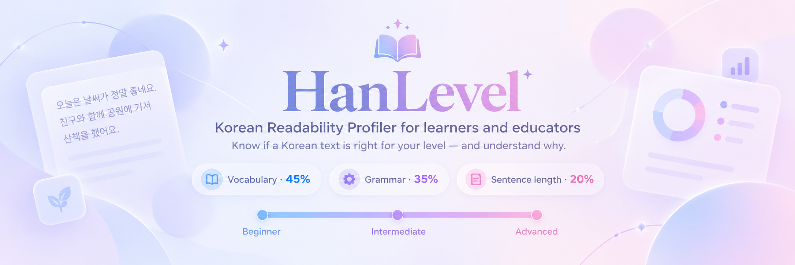
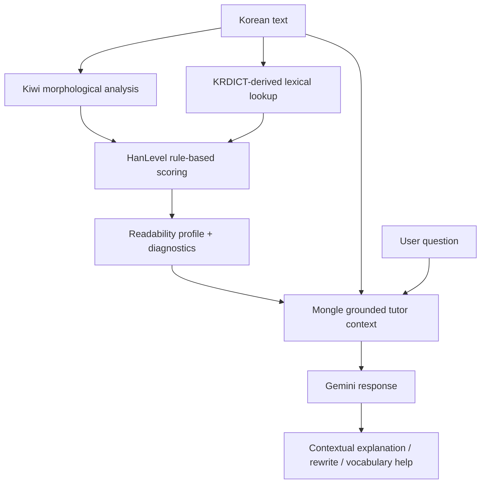

<p align="center">
  
</p>

<div align="center">

# ✦ HanLevel v1.0 ✦
### Korean Readability Profiler + Grounded AI Tutor

**Know if a Korean text is right for your level — understand why — and ask about it.**

[](https://hanlevel-v1.streamlit.app/)


</div>

---

## 🌸 Overview

**HanLevel** is an interpretable Korean readability profiler for learners and educators.

The original HanLevel analyzer estimates whether a Korean text is more suitable for a **Beginner**, **Intermediate**, or **Advanced** learner by combining three transparent signals:

| Indicator | Weight |
|---|---:|
| 📚 Vocabulary difficulty | **45%** |
| 🧩 Grammar & morphology | **35%** |
| ✦ Sentence length | **20%** |

HanLevel v1.0 adds **Mongle (몽글)**, a grounded AI tutor that receives the text **together with HanLevel's rule-based analysis** and helps the learner explore what the analyzer found.

The goal is no longer only:

> **How difficult is this Korean text?**

It is also:

> **Why is it difficult, what does this grammar do here, which words may be challenging, and how else could this idea be expressed?**

### 🌐 Live demo

**Try HanLevel v1.0:**  
https://hanlevel-v1.streamlit.app/

**ForgeHacks source branch:**  
https://github.com/liviaaguiarcc/HanLevel/tree/forge-v1.0

**Original v0.1 demo:**  
https://hanlevel.streamlit.app/

---

## 💗 Why HanLevel?

Learners often know that a Korean text feels difficult without knowing **what is making it difficult**.

A short sentence may contain:

- advanced vocabulary,
- dense connective or adnominal structures,
- nominalization,
- auxiliary constructions,
- long clauses,
- or several of these signals at the same time.

Traditional readability labels can hide those details. General-purpose chatbots can explain Korean, but they do not automatically know **what a separate linguistic analyzer actually detected**.

HanLevel combines both approaches:

1. **an interpretable NLP analyzer** measures the text;
2. **a grounded AI tutor** receives those measurements as context;
3. the learner can ask targeted questions about the same text.

This keeps the readability decision separate from the generative model.

---

## ✨ What HanLevel v1.0 does

### ① Analyze Korean readability

Paste Korean text and receive:

- estimated level: Beginner / Intermediate / Advanced,
- continuous HanLevel score,
- vocabulary difficulty,
- grammar complexity,
- sentence-length difficulty,
- weighted contribution of each component,
- dictionary coverage,
- vocabulary-level profile,
- challenging lexical items,
- detected structural markers,
- average eojeol per sentence.

### ② Explain the result transparently

HanLevel shows **why** the text received its result rather than returning only a label.

The analyzer remains rule-based and inspectable.

### ③ Ask Mongle (몽글)

After analysis, the learner can open the tutor and ask about the same text.

Suggested questions include:

- **What does this text mean?**
- **Why is this Beginner / Intermediate / Advanced?**
- **Explain the grammar**
- **Which words are difficult?**
- **Make it easier**
- **Make it more advanced**

The learner can also type a free-form question such as:

> Why is -는데 used here?

> Is there an easier word for 고려하다?

> Which expression sounds more natural in this sentence?

### ④ Continue the conversation

Mongle keeps limited recent conversation context so follow-up questions can refer back to the previous exchange.

The chat is intentionally bounded inside a scrollable panel so the page stays usable during longer study sessions.

### ⑤ Use the interface in three languages

The interface currently supports:

- **English**
- **Português**
- **Español**

Suggested-question labels and chat bubbles are localized, and the tutor is instructed to respond in the selected interface language.

---

## 🫧 Hybrid architecture

HanLevel v1.0 deliberately separates **analysis** from **generation**.



### Why this matters

The AI model does **not** assign the HanLevel score.

The score is produced independently by the rule-based analyzer.

Mongle receives:

- the original Korean text,
- the final HanLevel score,
- the estimated level,
- vocabulary difficulty,
- grammar complexity,
- sentence-length difficulty,
- dictionary coverage,
- detected intermediate/advanced vocabulary,
- detected weighted grammar markers,
- recent conversation context.

This makes the AI component more than a generic chat wrapper: its answers are conditioned on the linguistic evidence produced by the NLP pipeline.

---

## 🧠 The analyzer

### 1. 📚 Vocabulary difficulty — 45%

Korean lexical items are matched against learner-level information derived from the **Korean Learners' Dictionary (한국어기초사전)**.

| KRDICT level | HanLevel value |
|---|---:|
| 초급 | 0 |
| 중급 | 50 |
| 고급 | 100 |

Unclassified items are not automatically treated as difficult.

HanLevel also reports **dictionary coverage** so users can see how much of the analyzed lexical content could actually be assigned a learner level.

### 2. 🧩 Grammar & morphology — 35%

HanLevel uses **Kiwi / kiwipiepy** for Korean morphological analysis.

The grammar component currently considers selected structural markers such as:

- prefinal endings,
- connective endings,
- adnominal endings,
- nominalizing endings,
- auxiliary predicates,
- quotation particles,

plus morphological density.

This component estimates **structural complexity**. It is not an official pedagogical grammar-level classifier.

### 3. ✦ Sentence length — 20%

HanLevel uses average **eojeol per sentence** as an additional structural-complexity signal.

Longer sentences do not automatically mean a text is advanced, but sentence length can contribute meaningfully when combined with lexical and grammatical complexity.

---

## 🎀 Final HanLevel score

The three components are combined using:

```text
Vocabulary       45%
Grammar          35%
Sentence length  20%
```

Current project-specific thresholds:

| HanLevel score | Estimated level |
|---|---|
| `< 25` | Beginner |
| `25 – < 50` | Intermediate |
| `≥ 50` | Advanced |

> These thresholds are **project-specific and provisional**.  
> They are not official **TOPIK** or **CEFR** boundaries.

---

## 🤖 Mongle: the grounded AI tutor

**Mongle (몽글)** is the AI study companion introduced in HanLevel v1.0.

Mongle is designed to feel friendly and conversational while staying anchored to the analysis.

### Grounding rules

The tutor prompt explicitly instructs Mongle to:

- treat HanLevel's supplied diagnostics as the source of truth for analyzer results,
- never invent a HanLevel score,
- never invent a vocabulary grade or detected grammar marker,
- distinguish analyzer evidence from general Korean-language explanation,
- quote the relevant Korean expression when explaining grammar,
- provide concrete alternatives when asked for easier or more advanced wording,
- preserve meaning when proposing rewrites,
- avoid claiming official learner levels for alternatives unless the supplied analysis supports that claim.

### AI provider

The current tutor uses Google's Gemini API through the `google-genai` SDK.

Default model:

```text
gemini-3.5-flash
```

Fallback:

```text
gemini-3.5-flash-lite
```

The application limits retry behavior so temporary model errors do not create long hidden retry chains.

---

## 🌷 Example learning flow

A learner pastes:

```text
연구 결과를 해석할 때에는 통계적 유의성뿐만 아니라 연구 설계와 자료 수집 과정의 한계도 함께 고려해야 한다.
```

HanLevel first evaluates the text using the rule-based analyzer.

The learner can then ask Mongle:

```text
Why is this Advanced?
```

or:

```text
Is there an easier word for 고려하다?
```

or:

```text
Explain the most difficult grammar here.
```

The tutor receives the same analyzed text plus HanLevel's diagnostics and answers within that context.

---

## 🌼 Vocabulary profile

HanLevel exposes the lexical distribution behind the score.

A profile may look like:

```text
Beginner       18
Intermediate   32
Advanced        1
Unclassified    1
```

Repeated lexical items are included in profile counts, while the challenging-vocabulary list displays each item only once.

---

## 🪻 Grammar interpretability

HanLevel can display structural markers such as:

```text
-게       — Connective ending
-고       — Connective ending
있다      — Auxiliary verb
-(으)ㄴ   — Adnominal ending
-기       — Nominalizing ending
-(으)ㄹ   — Adnominal ending
않다      — Auxiliary verb
```

These are **interpretable structural signals**, not official pedagogical grammar-level labels.

---

## 🌍 Multilingual interface

HanLevel v1.0 includes interface localization for:

| Interface | Status |
|---|---|
| English | ✓ |
| Portuguese (Brazil) | ✓ |
| Spanish | ✓ |

The underlying Korean analysis remains unchanged by interface language.

The selected language controls interface labels and also guides Mongle's response language.

---

## 🧁 Tech stack

| Technology | Purpose |
|---|---|
| **Python** | Core application logic |
| **Streamlit** | Web interface |
| **Kiwi / kiwipiepy** | Korean morphological analysis |
| **KRDICT-derived local index** | Learner-level lexical lookup |
| **Google Gemini** | Grounded conversational tutor |
| **google-genai** | Gemini Python SDK |
| **GitHub** | Version control and source hosting |
| **Streamlit Community Cloud** | Deployment |

---

## 📖 Data source

HanLevel uses learner-level lexical information derived from:

**Korean Learners' Dictionary (한국어기초사전)**  
**National Institute of Korean Language**

Only the fields required by HanLevel are kept in the deployed compact index:

- written form,
- part of speech,
- vocabulary level.

The original KRDICT export was approximately **969 MB** across 11 JSON files.

For deployment, HanLevel preprocesses this into a compact lexical index of approximately **1.79 MB** while preserving the information used by the scoring pipeline.

> Please consult the Korean Learners' Dictionary / National Institute of Korean Language terms for reuse and attribution requirements applicable to the source data.

---

## 🧪 Internal calibration

The rule-based readability component was internally calibrated on a small development set containing:

- **5 Beginner texts**
- **5 Intermediate texts**
- **5 Advanced texts**

The current analyzer produced:

```text
15 / 15 matching classifications
```

on this constructed internal calibration set.

> This is **internal calibration agreement**, not a claim of 100% general accuracy.

The AI tutor is evaluated separately through manual qualitative testing for:

- grounding,
- grammar explanation,
- vocabulary support,
- follow-up context,
- multilingual behavior,
- rewrite usefulness,
- hallucination resistance.

See **[TESTING.md](TESTING.md)** for the current QA checklist.

---

## 🗂️ Project structure

```text
HanLevel/
│
├── app.py
├── analyzer.py
├── tutor_agent.py
├── krdict.py
├── calibration.py
├── build_krdict_index.py
├── calibration_results.csv
├── requirements.txt
├── README.md
├── TESTING.md
├── FORGEHACKS_SUBMISSION.md
├── .gitignore
│
├── .streamlit/
│   └── config.toml
│
├── images/
│   └── hanlevel-banner.png
│
└── data/
    └── krdict_index.json
```

---

## 💻 Run locally

### 1. Clone the repository

```bash
git clone https://github.com/liviaaguiarcc/HanLevel.git
cd HanLevel
git checkout forge-v1.0
```

### 2. Create a virtual environment

```bash
python -m venv .venv
```

### 3. Install dependencies

Windows:

```bash
.venv\Scripts\python.exe -m pip install -r requirements.txt
```

macOS / Linux:

```bash
.venv/bin/python -m pip install -r requirements.txt
```

### 4. Configure Gemini

Create:

```text
.streamlit/secrets.toml
```

with:

```toml
GEMINI_API_KEY = "your-key-here"
```

Optional creator-contact dialog:

```toml
CONTACT_EMAIL = "your-contact-email"
```

Never commit real API keys or private secrets.

### 5. Run HanLevel

Windows:

```bash
.venv\Scripts\python.exe -m streamlit run app.py
```

macOS / Linux:

```bash
.venv/bin/python -m streamlit run app.py
```

---

## 📦 Requirements

```txt
kiwipiepy
streamlit
google-genai
```

---

## 🏗️ ForgeHacks 2026

HanLevel v1.0 was built for the **AI + Education** track at **ForgeHacks Online 2026**.

The track asks builders to create an AI-powered solution that helps learners move beyond memorization toward understanding, connection-making, and application.

HanLevel approaches that problem by combining:

- transparent readability analysis,
- linguistic evidence,
- contextual explanation,
- learner-driven questioning,
- grounded generative AI.

### Hackathon disclosure

HanLevel is an extension of a pre-existing project.

**Before ForgeHacks:**

HanLevel v0.1 already included:

- the rule-based Korean readability analyzer,
- the KRDICT-derived compact lexical resource,
- Kiwi-based morphological analysis,
- the three-component scoring system,
- the original Streamlit readability interface,
- the internal calibration set.

The v0.1 code remains preserved on the repository's **`main`** branch.

**Built for ForgeHacks v1.0:**

- Mongle (몽글), the grounded AI tutor,
- Gemini integration,
- analyzer-to-tutor grounding context,
- suggested learner questions,
- free-form tutor chat,
- bounded conversation history,
- contextual follow-up support,
- easier / more advanced wording assistance,
- multilingual interface in English, Portuguese, and Spanish,
- localized suggested-question chat bubbles,
- tutor personality and avatar,
- in-app feedback / hallucination contact flow,
- ForgeHacks-specific UX and documentation.

This distinction is intentional and documented so judges can clearly see what was developed during the hackathon period.

---

## 🌙 Methodological principles

### HanLevel is

- an interpretable Korean readability profiler,
- an educational NLP prototype,
- a Korean language-learning support tool,
- a hybrid rule-based + generative AI system,
- a tool for exploring why a text may be difficult.

### HanLevel is not

- an official proficiency assessment,
- an official TOPIK predictor,
- a CEFR mapping tool,
- a validated large-scale readability benchmark,
- a substitute for a teacher or authoritative dictionary,
- a guarantee that every AI-generated explanation is error-free.

---

## 🪞 Current limitations

HanLevel v1.0 still has important limitations:

- the calibration set is small and internally constructed,
- classification thresholds are provisional,
- proper nouns and foreign-language items may remain unclassified,
- homonyms are not fully context-disambiguated by the readability analyzer,
- grammar complexity is based on structural indicators rather than a complete pedagogical grammar inventory,
- very short inputs provide less evidence,
- sentence length captures only one aspect of syntactic complexity,
- Gemini availability and latency depend on the external provider,
- the tutor may still produce incorrect or incomplete explanations,
- AI responses are grounded by HanLevel diagnostics but are not guaranteed to be factually perfect,
- conversation history is session-based and intentionally limited.

The interface includes a feedback path for users who notice a possible hallucination or incorrect explanation.

---

## 🚀 Roadmap

Possible future directions include:

- external validation on a larger Korean learner-text dataset,
- broader pedagogical grammar coverage,
- context-aware lexical disambiguation,
- richer evaluation of AI tutor faithfulness,
- persistent learner sessions,
- optional teacher-facing views,
- additional interface languages,
- more granular readability bands,
- learner-controlled explanation depth.

---

## 💡 Why interpretability matters

A readability system becomes more useful when learners can understand its reasoning.

Instead of only saying:

> **Advanced**

HanLevel can show that the result came from vocabulary, structural complexity, sentence length, and the weighted contribution of each component.

Then Mongle lets the learner ask:

> **What does that grammar do here?**

That combination turns a difficulty score into something the learner can actually study from.

---

## 🌸 Project motivation

HanLevel sits at the intersection of:

**Korean language learning × Linguistics × NLP × Educational technology × Generative AI**

The project explores how transparent NLP methods and generative AI can complement each other without collapsing into a black box.

The analyzer measures.

The tutor explains.

The learner decides what to explore next.

---

## 🔗 Try HanLevel

<div align="center">

### [🌷 Open HanLevel v1.0](https://hanlevel-v1.streamlit.app/)

**Analyze · Understand · Ask · Learn**

*Korean readability, explained — now with Mongle.*

</div>

---

## 🩷 Author

Developed by **Lívia Aguiar C. Cavalcanti**

Background and interests:

- Translation
- Korean language
- Natural Language Processing
- Corpus building
- Language technology
- Data analysis

---

<div align="center">

### ✦ HanLevel v1.0 ✦

**Korean Readability Profiler + Grounded AI Tutor**

[Open HanLevel v1.0](https://hanlevel-v1.streamlit.app/)

</div>
